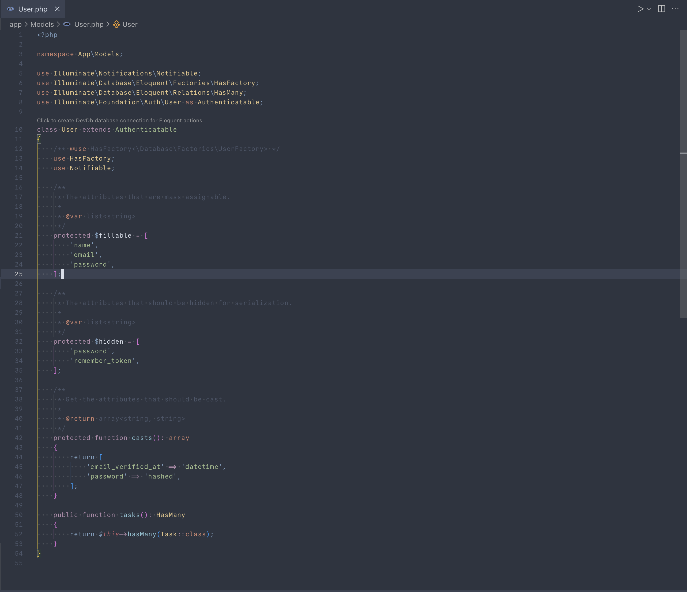
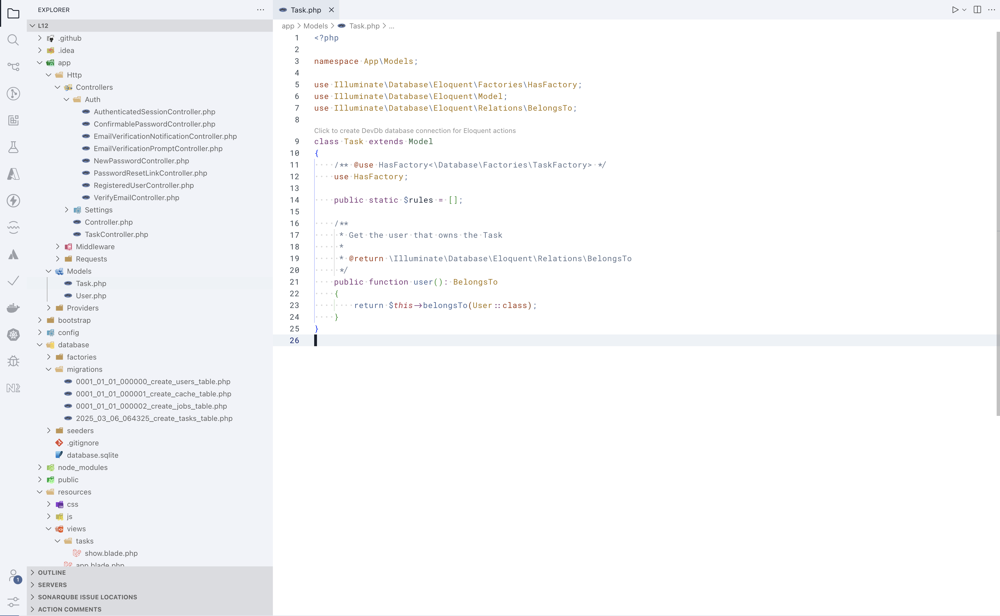
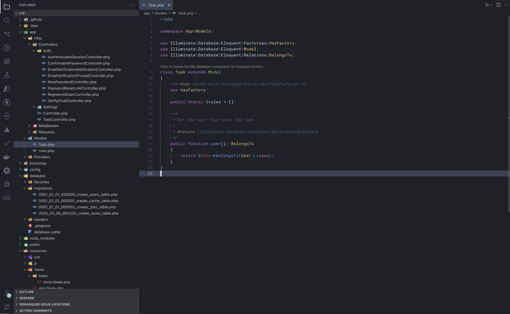

# Murora VS Code Themes

## Install

1. Go to [VS Marketplace](https://marketplace.visualstudio.com/items?itemName=GitHub.murora-vscode-theme).
2. Click on the "Install" button.
3. Then [select a theme](https://code.visualstudio.com/docs/getstarted/themes#_selecting-the-color-theme). The GitHub themes try to match the themes available in [github.com's settings](https://github.com/settings/appearance):
    - `Murora Dark`
    - `Murora Light`
    - `Murora One Dark`

## Screenshots

 Murora Dark

 Murora Light

 Murora One Dark

## Override this theme

To override this (or any other) theme in your personal config file, please follow the guide in the [color theme](https://code.visualstudio.com/api/extension-guides/color-theme) documentation. This is handy for small tweaks to the theme without having to fork and maintain your own theme.

## Publish (Maintainers)

> Note: Publishing a new version of this theme is only meant for maintainers.

**Enjoy!**
